# Binance Data Platform

## Overview

Binance Data Platform is an educational end-to-end data engineering project for collecting, processing, storing, and analyzing cryptocurrency market data.

The goal is to build a production-oriented batch data platform and systematically study:

- Apache Airflow orchestration;
- REST API ingestion;
- distributed data processing with Apache Spark;
- S3-compatible object storage;
- the Medallion architecture;
- Parquet;
- analytical storage in ClickHouse;
- SQL transformations and testing with dbt;
- idempotency, retries, pagination, and data quality.

The current dataset does not require distributed processing at its present size. Spark is included to study scalable processing patterns and design a pipeline that can handle larger data volumes.

---

## Architecture

```mermaid
flowchart LR
    A[Binance REST API]

    subgraph DAG1["DAG 1 — Extraction"]
        B[Airflow extraction task]
        C[Response and schema validation]
        D[Temporary JSON file]
        E[Upload to MinIO]
    end

    subgraph Storage["MinIO Data Lake"]
        F[Bronze JSON]
        G[Silver Parquet]
    end

    subgraph DAG2["DAG 2 — Processing"]
        H[spark-submit]
        I[PySpark transformation]
        J[Silver output validation]
        K[Load into ClickHouse]
        L[dbt run]
        M[dbt test]
    end

    N[ClickHouse Silver tables]
    O[ClickHouse Gold marts]
    P[Analytics and dashboards]

    A --> B
    B --> C
    C --> D
    D --> E
    E --> F

    F --> H
    H --> I
    I --> G
    G --> J
    J --> K
    K --> N
    N --> L
    L --> M
    M --> O
    O --> P
```



PostgreSQL is used only as the Airflow metadata and Celery result database. Pipeline data is not stored in PostgreSQL.

---

## Medallion Layers

### Bronze

The Bronze layer contains source-shaped Binance data with minimal modification.

Format:

- JSON.

MinIO bucket:

```text
bronze
```

Object key:

```text
binance/agg_trades/{symbol}/{YYYY/MM/DD}/trades.json
```

Example:

```text
s3://bronze/binance/agg_trades/BTCUSDT/2026/08/02/trades.json
```

### Silver

The Silver layer will contain cleaned, deduplicated, and typed data produced by PySpark.

Format:

- Apache Parquet.

Planned layout:

```text
s3://silver/binance/agg_trades/trade_date=2026-08-02/symbol=BTCUSDT/*.parquet
```

Silver transformations will include:

- explicit Spark schema;
- descriptive column names;
- decimal price and quantity types;
- timestamp conversion;
- invalid-record filtering;
- duplicate removal;
- derived trade value;
- partitioned Parquet output.

### Gold

The Gold layer will contain analytical models created with dbt inside ClickHouse.

Planned marts include:

- hourly trading statistics;
- daily trading statistics;
- trade count;
- traded asset quantity;
- monetary trade value;
- minimum, maximum, and average prices;
- datasets prepared for visualization.

---

## DAG 1 — Binance Extraction

Status: implemented.

The extraction DAG runs on a daily UTC data interval.

Responsibilities:

1. Receive validated Airflow parameters.
2. Convert the Airflow data interval to Binance API timestamps.
3. Request aggregate trades from Binance.
4. Continue pagination using the aggregate trade ID.
5. Validate the response and every trade record.
6. Store the result in a temporary JSON file.
7. Upload the file to the MinIO Bronze bucket.
8. Verify that the object exists in MinIO.
9. Delete the temporary local file.

### Parameters

The DAG accepts:

- `symbol` — Binance trading pair, for example `BTCUSDT`;
- `limit` — maximum number of trades requested per API page.

Airflow validates these parameters before task execution.

### Time interval semantics

Airflow uses a half-open data interval:

```text
[data_interval_start, data_interval_end)
```

Binance accepts inclusive `startTime` and `endTime` values. Therefore, the extraction converts the end of the Airflow interval to:

```text
data_interval_end - 1 millisecond
```

This prevents adjacent daily runs from requesting the same boundary timestamp.

### Pagination

The first request uses:

```text
symbol
limit
startTime
endTime
```

Subsequent requests use:

```text
symbol
limit
fromId
```

The Binance `fromId` parameter is inclusive. The next cursor is therefore calculated as:

```text
last_trade_id + 1
```

Pagination stops when:

- Binance returns an empty page; or
- a trade is later than the requested interval.

A cursor-advance guard prevents an infinite pagination loop.

### Validation

The pipeline validates:

- that the Binance response is a list;
- that a non-terminal response is not empty;
- that every record matches the Pydantic schema;
- that unexpected fields are rejected.

### Idempotency

The Bronze object key is deterministic for a symbol and date:

```text
binance/agg_trades/{symbol}/{YYYY/MM/DD}/trades.json
```

A repeated run for the same symbol and data interval overwrites the same logical object instead of creating a duplicate object with a run-specific name.

### Reliability

The DAG uses:

- task retries;
- exponential retry backoff;
- a maximum retry delay;
- an HTTP timeout;
- one active DAG run at a time;
- a DAG run timeout;
- an error callback;
- post-upload object verification.

---

## XCom Usage

The extraction task returns only file metadata:

```python
{
    "filepath": "...",
    "key": "...",
}
```

Airflow stores this value in XCom under the `return_value` key.

Downstream tasks use it to locate the temporary file and the target MinIO key. The actual Binance dataset is not transferred through XCom.

---

## DAG 2 — Spark Processing

Status: planned.

The second DAG will:

1. Submit a standalone PySpark application.
2. Read the requested Bronze JSON object.
3. Transform it into a typed Silver DataFrame.
4. Write partitioned Parquet to MinIO.
5. Validate that the Silver output exists.
6. Load the requested partition into ClickHouse.
7. Execute dbt models.
8. Execute dbt tests.

During development, DAG 2 will be manually triggered for a particular symbol and date. After stabilization, it will be connected to the successful completion of DAG 1.

---

## Spark Application

The Spark transformation will be implemented as an independent application.

Airflow will orchestrate the application but will not contain its transformation logic.

The application will receive runtime arguments such as:

```text
symbol
processing_date
bronze input path
silver output path
```

It must also be runnable independently through `spark-submit`.

This separation allows the transformation to be:

- tested independently;
- executed outside Airflow;
- reused by another orchestrator;
- developed without importing Airflow internals.

---

## ClickHouse and dbt

ClickHouse will serve as the analytical database.

Silver Parquet partitions will be loaded into typed ClickHouse tables. Reprocessing a date must replace or deduplicate the corresponding partition rather than append duplicate rows.

dbt will then create Gold analytical models inside ClickHouse.

Spark and dbt have different responsibilities:

- Spark performs file-level cleaning, typing, deduplication, and Parquet generation.
- dbt performs SQL-based analytical modeling, documentation, and data testing.

---

## Technology Stack

### Implemented

- Python 3.12
- Apache Airflow 3.3
- CeleryExecutor
- Redis
- PostgreSQL for Airflow metadata
- MinIO
- Pydantic v2
- Pytest
- Ruff
- uv
- Docker Compose

### Planned

- Apache Spark
- PySpark
- Apache Parquet
- ClickHouse data loading
- dbt with ClickHouse
- analytical dashboards

---

## Project Structure

```text
.
├── dags
│   ├── dag_extract_binance.py
│   └── acme
│       ├── clients
│       ├── config
│       ├── extract
│       ├── models
│       ├── quality
│       ├── storage
│       └── utils
├── tests
├── Dockerfile
├── docker-compose.yaml
├── pyproject.toml
├── requirements.txt
├── uv.lock
└── README.md
```

Spark application directories and dbt project directories will be added in later stages.

---

## Testing

Run unit tests:

```bash
uv run pytest
```

The existing test suite covers:

- Binance HTTP client behavior;
- Pydantic trade schema;
- pagination;
- time interval conversion;
- Bronze object-key generation;
- response validation.

---

## Code Quality

Run Ruff checks:

```bash
uv run ruff check .
```

Check formatting:

```bash
uv run ruff format --check .
```

Format the project:

```bash
uv run ruff format .
```

---

## Docker Validation

Validate Docker Compose configuration:

```bash
docker compose config --quiet
```

Build the custom Airflow image:

```bash
docker compose build airflow-scheduler
```

---

## Current Status

### Completed

- [x] Airflow environment with CeleryExecutor
- [x] reproducible Airflow Docker image
- [x] Binance aggregate-trade extraction
- [x] daily UTC data intervals
- [x] API pagination
- [x] response validation
- [x] strict Pydantic schema
- [x] deterministic Bronze object keys
- [x] MinIO Bronze storage
- [x] temporary file cleanup
- [x] task retries with exponential backoff
- [x] unit tests
- [x] Ruff checks

### Next

- [ ] add Spark infrastructure
- [ ] implement Bronze-to-Silver PySpark application
- [ ] write partitioned Parquet to MinIO
- [ ] create DAG 2
- [ ] implement idempotent ClickHouse loading
- [ ] create dbt models and tests
- [ ] build analytical dashboards