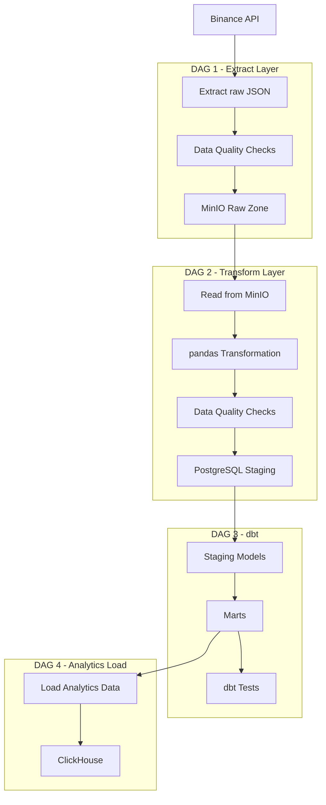

# Binance Data Platform

## Overview

End-to-end data engineering platform for collecting, processing and analyzing cryptocurrency market data from Binance API.

The project demonstrates a production-oriented ETL pipeline using:

- Apache Airflow
- MinIO
- PostgreSQL
- dbt
- ClickHouse

Main goals:

- raw data ingestion;
- data quality validation;
- schema validation;
- data transformation;
- analytical data modeling.

---

# Architecture



---

# Data Pipeline

## DAG 1 - Extract Binance Trades

Implemented.

Responsibilities:

- Extract data from Binance API.
- Validate API response.
- Validate trade schema with Pydantic.
- Store raw JSON locally.
- Upload data to MinIO.
- Remove temporary files.

Technologies:

- Airflow PythonOperator
- MinIO S3 API
- Pydantic v2
- Pytest


Raw storage format:

```
raw/binance/trades/{symbol}/{YYYY/MM/DD}/trades.json
```

Example:

```
raw/binance/trades/BTCUSDT/2026/07/30/trades.json
```

---

# Data Quality

The pipeline uses multiple validation layers.

## Raw Data Validation

Checks:

- response format;
- empty response;
- expected record count.

## Schema Validation

Implemented using Pydantic models.

Example:

```python
class BinanceAggTrade(BaseModel):
    id: int
    price: str
    qty: str
    time: int
    isBuyerMaker: bool
    isBestMatch: bool
```

---

# Tech Stack

## Orchestration

- Apache Airflow 3.x
- PythonOperator
- TaskFlow API (planned)

## Storage

- MinIO
- PostgreSQL

## Transformation

- pandas
- dbt

## Analytics

- ClickHouse

## Development

- Python 3.12
- Pydantic v2
- Pytest
- Ruff
- uv
- Docker Compose
- Git

---

# Project Structure

```
.
├── dags
│   ├── dag_extract_binance.py
│   └── acme
│       ├── clients
│       ├── extract
│       ├── models
│       ├── quality
│       ├── storage
│       └── utils
│
├── tests
│   ├── test_binance_model.py
│   ├── test_validate_binance.py
│   └── test_paths.py
│
├── docker-compose.yaml
├── pyproject.toml
├── uv.lock
└── README.md
```

---

# Testing

Implemented tests:

- Pydantic model validation;
- raw data validation;
- storage path generation.

Run:

```bash
uv run pytest
```

---

# Code Quality

Ruff is used for:

- import sorting;
- style checks;
- static analysis.

Run:

```bash
uv run ruff check .
```

---

# Local Setup

## Requirements

- Docker
- Docker Compose
- Python 3.12+
- uv


## Install dependencies

```bash
git clone https://github.com/avasin12/binance-data-platform.git

cd binance-data-platform

uv sync
```


---

# Current Status

Implemented:

- [x] Airflow environment
- [x] Binance API extraction
- [x] Raw data validation
- [x] Pydantic schema validation
- [x] MinIO raw storage
- [x] Temporary file cleanup
- [x] Unit tests
- [x] Ruff linting
- [x] uv dependency management


In progress:

- [ ] DAG 2: pandas transformation pipeline
- [ ] PostgreSQL staging layer
- [ ] dbt models
- [ ] ClickHouse analytics layer