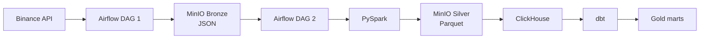

# Binance Data Platform

An educational data engineering project for collecting and processing Binance
market data. The goal is to build a small but production-minded batch platform
and use it to study Airflow, Spark, object storage, ClickHouse, and dbt as parts
of one system.

The current data volume does not require Spark. It is included to practise the
same processing patterns that are used when data no longer fits comfortably on
one machine.

## Architecture



The Bronze extraction is implemented. Spark processing, ClickHouse loading,
and dbt models are the next stages.

PostgreSQL is used only by Airflow for metadata and Celery results. Pipeline
data is stored in MinIO and ClickHouse.

## What works now

`dag_extract_binance` extracts one UTC day of aggregate trades for a selected
symbol:

1. Airflow validates `symbol` and API page `limit` parameters.
2. The task requests Binance data page by page.
3. Every non-empty page is validated with Pydantic.
4. The complete result is saved as JSON and uploaded to MinIO.
5. The upload is verified and the temporary local file is removed.

Bronze objects use a deterministic path:

```text
s3://bronze/binance/agg_trades/{symbol}/{YYYY/MM/DD}/trades.json
```

Running the same symbol and date again overwrites the same logical object
instead of creating a duplicate.

### Important implementation details

- Airflow works with `[start, end)` intervals, while Binance timestamps are
  inclusive. The requested Binance end is therefore `data_interval_end - 1 ms`.
- The first API request uses the time interval. Following requests continue
  with `fromId = last_aggregate_trade_id + 1` because `fromId` is inclusive.
- A cursor guard prevents an infinite pagination loop.
- XCom contains only the local filepath and MinIO key, not the trade dataset.
- Tasks use retries with exponential backoff, a maximum retry delay, and HTTP
  timeouts.
- Only one DAG run can be active at a time.

## Next stage: Spark

The next component will be a standalone PySpark application launched by the
second Airflow DAG.

It will:

- read Bronze JSON from MinIO;
- apply an explicit schema and readable column names;
- convert prices and quantities to decimal types;
- convert event time to a timestamp;
- filter invalid rows and remove duplicates;
- calculate trade value;
- write partitioned Parquet to the Silver bucket.

Planned Silver layout:

```text
s3://silver/binance/agg_trades/trade_date={date}/symbol={symbol}/*.parquet
```

Silver data will then be loaded idempotently into ClickHouse. dbt will build and
test analytical models such as hourly and daily trade statistics.

## Stack

| Area | Technology | Status |
|---|---|---|
| Orchestration | Apache Airflow 3.3, CeleryExecutor | Implemented |
| Queue and metadata | Redis, PostgreSQL | Implemented |
| Bronze storage | MinIO, JSON | Implemented |
| Validation | Pydantic v2 | Implemented |
| Distributed processing | Apache Spark, PySpark | Next |
| Silver storage | MinIO, Parquet | Next |
| Analytics | ClickHouse | Planned |
| Modeling | dbt | Planned |
| Development | Python 3.12, uv, Pytest, Ruff | Implemented |

## Development

Install the locked Python environment:

```bash
uv sync --locked
```

Run tests and lint checks:

```bash
uv run pytest
uv run ruff check .
uv run ruff format --check .
```

Validate and start the Docker environment:

```bash
docker compose config --quiet
docker compose build
docker compose up -d
```

The local environment expects a configured `.env` file, an Airflow S3
connection named `minio_client`, and a MinIO bucket named `bronze`.

## Roadmap

- [x] Daily Binance extraction
- [x] API pagination and schema validation
- [x] Deterministic Bronze storage
- [x] Airflow retries and temporary-file cleanup
- [x] Unit tests and reproducible Airflow image
- [ ] Spark infrastructure
- [ ] Bronze-to-Silver PySpark application
- [ ] Second Airflow DAG
- [ ] Idempotent ClickHouse loading
- [ ] dbt models and tests
- [ ] Analytical dashboard
