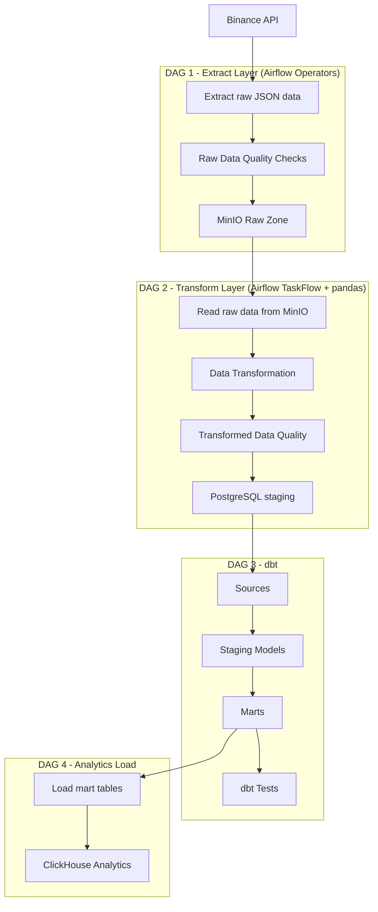

# Binance Data Platform

## Overview

End-to-end data engineering platform for collecting, processing, storing and analyzing cryptocurrency market data from Binance API.

The project demonstrates a production-oriented ETL pipeline using Apache Airflow, MinIO, PostgreSQL, dbt and ClickHouse.

The main goal is to build a scalable data platform with:

- raw data storage;
- data quality validation;
- schema validation;
- transformation layer;
- analytical data models.

---

# Architecture



---

# Data Pipeline

## DAG 1 - Extract Binance Trades

Current implementation.

Responsibilities:

- Extract market data from Binance API.
- Validate API response structure.
- Validate trade schema using Pydantic models.
- Save raw JSON data locally.
- Upload raw data to MinIO.
- Remove temporary local files after successful upload.

Implemented components:

- Airflow PythonOperator
- MinIO S3-compatible storage
- Pydantic schema validation
- Data quality checks
- Pytest coverage


Raw data storage format:

```
raw/binance/trades/{symbol}/{YYYY/MM/DD}/{run_id}/trades.json
```

Example:

```
raw/binance/trades/BTCUSDT/2026/07/30/manual__2026-07-30T00:00:00/trades.json
```

---

# Tech Stack

## Orchestration

- Apache Airflow 3.x
- PythonOperator
- TaskFlow API (planned)

## Storage

- MinIO (S3-compatible object storage)
- PostgreSQL

## Transformation

- pandas
- dbt (planned)

## Analytics

- ClickHouse (planned)

## Development

- Python 3.12
- Pydantic v2
- Pytest
- Ruff
- Docker Compose
- Git

---

# Data Quality

The pipeline contains multiple validation layers.

## Raw Data Validation

Implemented checks:

- API response type;
- empty response detection;
- expected number of records.

Example:

```python
if len(data) != limit:
    logger.warning(
        "Received %s trades instead of expected %s",
        len(data),
        limit,
    )
```

---

## Schema Validation

Schema validation is implemented using Pydantic.

Example:

```python
from pydantic import BaseModel


class Trade(BaseModel):
    id: int
    price: str
    qty: str
    quoteQty: str
    time: int
    isBuyerMaker: bool
    isBestMatch: bool
```

The model validates incoming Binance trade objects before storing raw data.

---

# Project Structure

```
.
├── dags
│   ├── dag_extract_binance.py
│   └── acme
│       ├── clients
│       │   └── minio_client.py
│       │
│       ├── extract
│       │   └── extract_binance.py
│       │
│       ├── models
│       │   └── binance.py
│       │
│       ├── quality
│       │   └── validate_binance.py
│       │
│       ├── storage
│       │   ├── files.py
│       │   └── paths.py
│       │
│       └── utils
│           ├── dag_context.py
│           └── dag_params.py
│
├── tests
│   ├── test_binance_model.py
│   ├── test_validate_binance.py
│   └── test_paths.py
│
├── docker-compose.yaml
├── dockerfile
├── requirements.txt
├── pyproject.toml
└── README.md
```

---

# Testing

The project uses Pytest for automated testing.

Current test coverage includes:

- Pydantic models validation;
- raw data quality validation;
- storage path generation.

Run tests:

```bash
pytest
```

---

# Code Quality

Ruff is used for:

- import sorting;
- code style checks;
- common Python errors detection.

Run lint:

```bash
ruff check .
```

---

# Local Setup

## Requirements

- Docker
- Docker Compose
- Python 3.12+

---

## Clone repository

```bash
git clone https://github.com/avasin12/binance-data-platform.git

cd binance-data-platform
```

---

## Environment variables

Create `.env` file:

```
AIRFLOW_UID=50000
```

Configure Airflow Variables:

```
binance_api_url
minio_raw_bucket
```

Configure Airflow Connection:

```
minio_client
```

---

## Start services

```bash
docker compose up -d
```

---

## Run tests

```bash
pytest
```

---

## Run lint

```bash
ruff check .
```

---

# Current Status

Implemented:

- [x] Airflow environment
- [x] Binance API extraction
- [x] Raw data quality validation
- [x] Pydantic schema validation
- [x] MinIO raw storage
- [x] Temporary file cleanup
- [x] Unit tests
- [x] Ruff linting

In progress:

- [ ] DAG 2: pandas transformation pipeline
- [ ] PostgreSQL staging layer
- [ ] dbt transformations
- [ ] ClickHouse analytics layer